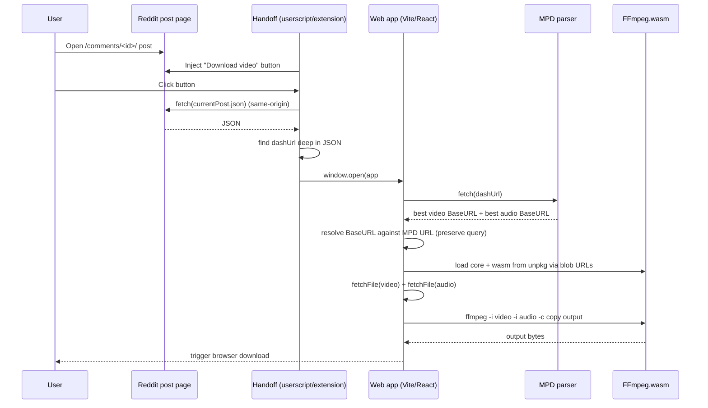

# Reddit Video Downloader

A **browser-native** Reddit video downloader that produces a single **muxed MP4 (video + audio)** by combining Reddit’s DASH streams entirely **client-side** using **FFmpeg.wasm**.

This repository contains three cooperating deliverables:

1. **Web app (React + Vite)** — does MPD parsing, selects best audio/video, downloads both streams, muxes them with FFmpeg.wasm, and triggers a browser download.
2. **Handoff layer** — either a **Userscript** (Tampermonkey) or a **Chrome Extension (MV3)**. This runs *on reddit.com* where same-origin fetch is allowed and extracts the signed `dashUrl`.
3. **(Empty) `api/` folder** — kept as a placeholder from earlier experiments; the current architecture is intentionally **no-backend**.

> [!NOTE]
> The repository’s core complexity is not React. It’s browser security: **CORS + Same-Origin Policy** make “just fetch the MPD from a website” fail unless you run code in a privileged origin (Reddit via userscript/extension) or proxy it.

---

## Screenshots

**TODO**: add screenshots / GIFs of:

- The injected **Download video** button on Reddit.
- The web app “Download your video” flow.
- The developer details panel.

---

## Supported workflows

### Workflow A — Userscript (recommended for fast iteration)

1. Install the userscript from `userscript/reddit-video-handoff.user.js`.
2. Open a Reddit post page (must include `/comments/<id>/`).
3. Click **Download video**.
4. A new tab opens to the web app with `#dashUrl=<...>` in the URL.
5. Click **Download your video** to mux and download.

### Workflow B — Chrome extension (MV3)

1. Load `extension/` as an unpacked extension.
2. Same flow as the userscript.

---

## Why this project exists

Reddit-hosted videos are commonly served as **DASH** (Dynamic Adaptive Streaming over HTTP):

- The video is not one file; it’s a manifest (`.mpd`) plus separate media resources.
- The **video and audio are separate**.
- The `.mpd` URL (and the segment URLs it points to) are usually **signed** and **time-limited**.

That means:

- “Save video as…” typically fails or downloads only the video track.
- Copy/paste of a direct MP4 URL often doesn’t exist.
- Even if you can see a DASH URL in page data, fetching it from a different origin can be blocked by browser security.

This project solves that by:

1. Running a tiny “handoff” script *on Reddit* (userscript/extension) to grab the signed `dashUrl` using same-origin fetch.
2. Handing that URL to a standalone web app.
3. Parsing the MPD to choose the best streams.
4. Downloading both streams and **muxing them locally** with FFmpeg.wasm.

---

## Overall architecture

### High-level diagram (ASCII)

```
User
 │
 ▼
Reddit (post page)
 │
 │  (same-origin fetch of post.json)
 ▼
Userscript or Extension
 │
 │  extracts signed dashUrl (MPD URL)
 ▼
Web App (React)
 │
 │  fetch MPD
 ▼
MPD parsing + quality selection
 │
 │  fetch best video + best audio
 ▼
FFmpeg.wasm muxing
 │
 ▼
Browser download (output.mp4)
```

### Execution flow (sequence)



---

## Repository structure

| Path | What it contains | Notes |
|------|------------------|-------|
| `src/` | React web app | All muxing happens here |
| `src/lib/redditDiscovery.js` | DASH discovery + MPD parsing | Fetches Reddit JSON, parses MPD, selects best streams |
| `userscript/` | Tampermonkey userscript | Same logic as extension content script |
| `extension/` | Chrome extension (MV3) | Content-script-only, injects button |
| `public/` | Static assets | Favicons + icons |
| `api/` | Empty | Placeholder; current architecture is no backend |
| `dist/` | Build output | Generated by `vite build` |

---

## React application (`src/`)

### Routing

There is **no router**.

The app is a single page that reads input from the URL **hash**:

- `#dashUrl=<urlencoded>`

This is implemented in `src/App.jsx` via `readDashUrlFromHash()`.

> [!WHY]
> Using the hash avoids server-side routing concerns (e.g. Vercel rewrites) and keeps the handoff simple: the handoff script can open a single static URL and only needs to set `location.hash`.

### UI + state management

State is handled entirely with React hooks in `src/App.jsx`:

- `result`: the discovered best audio/video URLs and metadata
- `verification`: optional fetch-and-blob verification results (status/content-type/size)
- `isMuxing` + `muxStatus`: drive the “Working…” UX
- `error`: surfaced in a red error box
- `showDev`: toggles the “Developer details” diagnostics JSON panel

There is intentionally **no global state** and **no state library**.

### Discovery and verification

On mount:

1. Parse `dashUrl` from the hash.
2. Call `discoverFromDashUrl(dashUrl)`.
3. Store the result.

After `result` is set, a second effect tries to `fetch()` both the chosen video and audio URLs and records:

- HTTP status
- content type
- blob size

This is primarily a **debugging aid** (exposed in the Developer details panel).

### Downloading + muxing

The “Download your video” button triggers `onDownloadMuxed()` in `src/App.jsx`:

1. Instantiate `FFmpeg` from `@ffmpeg/ffmpeg`.
2. Load the FFmpeg core assets from **unpkg**:
	 - `https://unpkg.com/@ffmpeg/core@0.12.9/dist/esm/ffmpeg-core.js`
	 - `https://unpkg.com/@ffmpeg/core@0.12.9/dist/esm/ffmpeg-core.wasm`
3. Convert those URLs into blob URLs via `toBlobURL(...)`.
4. Download video/audio bytes via `fetchFile(url)`.
5. Write them to FFmpeg’s in-memory FS.
6. Run:

	 ```bash
	 ffmpeg -i video.mp4 -i audio.mp4 -c copy output.mp4
	 ```

7. Read `output.mp4` from FS, create a Blob, and trigger a download.
8. Best-effort delete the temporary files and `terminate()` FFmpeg.

> [!IMPORTANT]
> This project uses the **single-thread** ESM core. The code explicitly avoids fetching `ffmpeg-core.worker.js` because fetching that worker from a CDN can be blocked by CORS.

### Error handling philosophy

The UI is deliberately “engineering-first”:

- errors are shown verbatim in a `<pre>`
- diagnostics can be copied as JSON
- FFmpeg logs go to `console.log('[ffmpeg]', ...)`

This is intended to make future debugging easier.

---

## Extension (`extension/`)

### Manifest

The extension is **Manifest V3** and is **content-script-only**.

`extension/manifest.json`:

- `manifest_version: 3`
- Runs `content.js` on `https://www.reddit.com/*`
- No host permissions beyond that match pattern
- No background service worker

> [!WHY]
> MV3 is the current Chrome platform direction. This extension does not need long-lived background execution; it only needs to run on Reddit pages and open a new tab.

### Content script design

`extension/content.js`:

- Injects a fixed-position button (`#rvd-handoff-btn`).
- Shows the button only when `location.pathname` looks like a post URL (`/comments/<id>/`).
- Polls `location.href` every 500ms to handle Reddit’s SPA navigation.

When clicked:

1. Build the current post’s JSON endpoint: `currentPath + '.json'`.
2. `fetch()` that endpoint (same origin: `www.reddit.com`).
3. Parse JSON.
4. Deep-search for `dashUrl` / `dash_url`.
5. Open the app:

	 `https://reddit-video-downloader-2.vercel.app/#dashUrl=<encoded>`

### Communication with the web app

Communication is intentionally “dumb”: **a single URL** with a hash parameter.

- Pros: no messaging channel, no permissions, works with userscript and extension.
- Cons: the MPD URL is exposed in the address bar (but it is already time-limited).

---

## Userscript (`userscript/`)

`userscript/reddit-video-handoff.user.js` is functionally equivalent to the extension content script.

### Why it exists

- Lowest-friction way to run code on Reddit pages.
- Easier iteration than extension packaging.
- Works on multiple Reddit hosts (`reddit.com`, `www.reddit.com`, `old.reddit.com`).

### Differences vs the extension

| Aspect | Userscript | Extension |
|--------|------------|-----------|
| Install | Tampermonkey/Greasemonkey | Chrome “Load unpacked” (or store) |
| Match patterns | `reddit.com`, `www`, `old` | only `https://www.reddit.com/*` |
| Update model | manual / URL install | extension update flow |

### Execution flow

Same as the extension:

- inject button
- fetch post `.json` same-origin
- find `dashUrl`
- open the web app with `#dashUrl=`

---

## DASH discovery (`src/lib/redditDiscovery.js`)

This file contains the “media discovery layer”. It is responsible for going from **a signed MPD URL** to **concrete audio/video resource URLs**.

### Entry points

The file exposes several utilities:

- `toRedditJsonUrl(redditPostUrl)`
	- normalizes various Reddit URL forms into a `.json` endpoint
	- includes minimal hostname validation (`reddit.com` / `redd.it`)

- `findDashUrlDeep(node)`
	- recursively traverses a JSON-like object and returns the first `dashUrl` / `dash_url` found
	- uses a `visited` Set to avoid cycles

- `resolveBaseUrlAgainstMpd(mpdUrl, baseUrlText)`
	- resolves a representation `BaseURL` (usually relative) against the MPD URL
	- **preserves MPD query params** if the BaseURL doesn’t specify its own query string
	- this is crucial because Reddit’s signatures commonly live in the MPD query

> [!IMPORTANT]
> The web app currently starts from `dashUrl` directly (handoff provides it). The `toRedditJsonUrl(...)` and `findDashUrlDeep(...)` functions are part of a more general discovery story and match the logic duplicated in the userscript/extension.

### MPD parsing

Parsing is done with the browser’s built-in XML parser (`DOMParser`).

The algorithm:

1. Collect all `<Representation>` elements.
2. For each representation:
	 - determine `mimeType` (from the representation or its parent `<AdaptationSet>`)
	 - read `bandwidth` and `height` attributes
	 - find the first `<BaseURL>` within the representation
3. Partition representations into video vs audio.
4. Filter to MP4 representations (`mimeType` includes `mp4`).
5. Select:
	 - best video: sort by `height` desc, then `bandwidth` desc
	 - best audio: sort by `bandwidth` desc

### URL construction

Reddit MPDs often use relative `BaseURL`s. The code resolves them using:

```js
resolveBaseUrlAgainstMpd(mpdUrl, baseUrlText)
```

and then carries forward the MPD query string if needed.

---

## FFmpeg.wasm integration

This project uses:

- `@ffmpeg/ffmpeg` (wrapper)
- `@ffmpeg/util` (`fetchFile`, `toBlobURL`)

### Why FFmpeg is needed

Reddit provides separate audio/video resources. To produce a normal downloadable MP4 you need to **mux** (merge) those tracks.

### Why muxing is client-side

There is no backend by design:

- avoids handling user media
- avoids storage and bandwidth costs
- avoids building an “illegal” proxy that could be abused

### Performance + memory notes

- `fetchFile()` loads the entire media resource into memory.
- FFmpeg FS is in-memory.
- The output MP4 is also held as a Blob before download.

For large videos, this can be memory intensive.

---

## Browser security (largest section)

Browser security constraints are the reason this repository has multiple deliverables.

### Same-Origin Policy (SOP)

The browser treats `https://www.reddit.com` and `https://reddit-video-downloader-2.vercel.app` as different **origins**.

By default, a script on origin A cannot read responses from origin B unless origin B explicitly allows it.

### CORS

Cross-Origin Resource Sharing (CORS) is the mechanism by which origin B can opt-in to being readable by origin A.

In this project:

- The web app runs on `reddit-video-downloader-2.vercel.app`.
- The MPD and media resources are hosted on Reddit’s infrastructure.
- Reddit does **not** reliably provide permissive CORS headers for these resources.

So:

- **Pure frontend** (web app alone) cannot reliably fetch Reddit’s MPD and media.

### Why frontend fetch fails

Even if the URL is correct, the browser may block access due to:

- missing `Access-Control-Allow-Origin` on the response
- `opaque` responses (no body access)
- preflight failures depending on headers

### Why a backend proxy was attempted (and why it’s absent now)

This repo includes an `api/` folder, but it’s empty. That reflects the current state:

- there is no maintained proxy implementation in this repository
- the project intentionally avoids acting as a network relay for Reddit content

Common proxy failure modes (documented here because they motivated the current design):

- Reddit can return **403** when requests don’t look like a real browser session.
- Signed URLs can be short-lived; caching is difficult.
- Running a proxy creates abuse potential (your server becomes a general-purpose fetcher).

### Why userscripts work

A userscript runs **in the context of reddit.com** (same origin). That means:

- `fetch("/r/.../comments/<id>.json")` is same-origin
- CORS does not apply the same way because you’re not crossing origins

It can therefore retrieve the signed `dashUrl` that the web app can’t get directly.

### Why extensions work

The extension is also executing code on reddit.com as a content script.

While content scripts are “isolated worlds”, they still have **access to the page’s origin** for network requests to same-origin endpoints.

### Why a pure web app cannot work (in this architecture)

Without running code on Reddit itself or proxying through a backend, the web app would have to:

- discover the dash URL from a URL the user pasted, and
- fetch Reddit’s MPD + media cross-origin.

This is not reliably possible due to CORS.

### Diagram: why a proxy/handoff is required

```mermaid
flowchart LR
	subgraph RedditOrigin[Origin: https://www.reddit.com]
		JSON[post.json]\n(dashUrl inside)
		MPD[MPD + media URLs]\n(signed)
	end

	subgraph AppOrigin[Origin: https://reddit-video-downloader-2.vercel.app]
		APP[Web app JS]
	end

	APP -. blocked by CORS/SOP .-> JSON
	H[Userscript/Extension]\n(runs on Reddit) --> JSON
	H -->|opens app with dashUrl| APP
	APP --> MPD
```

---

## Design decisions (what + why)

### Why React?

- Simple state-driven UI
- Easy dev tooling and component model
- The app is small enough that plain React hooks are sufficient

### Why Vite?

- Fast local dev
- Straightforward static build for Vercel

### Why FFmpeg.wasm?

- Browser APIs do not provide a general MP4 muxer.
- FFmpeg is the “known good” tool for muxing container formats.

### Why no backend?

- Avoid handling user media on a server
- Avoid storage/bandwidth costs
- Avoid creating an abuse-prone proxy

### Why an extension *and* a userscript?

- Userscript is easiest for dev/testing
- Extension is easier for non-technical usage and store distribution

### Why communicate via `#dashUrl=`?

- No extension messaging complexity
- No extra permissions
- Compatible with both handoff mechanisms

---

## Development history (engineering notes)

The following history is inferred from the repository state:

1. A minimal Vite/React app was scaffolded (default template remnants remain in CSS).
2. The hard problem became browser security / CORS.
3. A “handoff” approach was implemented:
	 - userscript first (broad host matching)
	 - extension second (MV3 content script)
4. The current web app expects to be opened with a signed `dashUrl` in the URL hash.
5. The `api/` folder remains empty, suggesting the proxy approach was removed.

> [!TODO]
> If you want this section to be a true timeline, add dates/commits and link PRs. The repository currently doesn’t encode dates in docs.

---

## Local development

### Web app

- Install deps: `npm install`
- Run dev server: `npm run dev` (configured for port **3000** in `vite.config.js`)
- Build: `npm run build`
- Preview production build: `npm run preview`
- Lint: `npm run lint` (Oxlint)

### Load the extension

See `extension/README.md`.

### Install the userscript

1. Install Tampermonkey.
2. Create a new script and paste `userscript/reddit-video-handoff.user.js`.
3. Save.
4. Visit a Reddit post and click the injected button.

---

## Deployment

The handoff scripts open a hard-coded production origin:

- `https://reddit-video-downloader-2.vercel.app`

This indicates the web app is deployed on **Vercel**.

> [!NOTE]
> This repository does not include Vercel project metadata beyond the `.vercel/` folder. If you need to document auto-deploy hooks (Git integration, preview deployments, etc.), that information lives in Vercel, not in this codebase.

---

## Security

- No backend service.
- No tracking, analytics, telemetry.
- No video uploads: muxing is local.
- No user data stored.

---

## Known limitations

- **Signed URLs expire**. If you wait too long between clicking the Reddit button and muxing, downloads can fail.
- Reddit can change their JSON structure and break `dashUrl` discovery.
- Reddit can change MPD structure and break parsing.
- Large videos may exhaust browser memory (full in-memory buffering).
- The extension currently matches only `https://www.reddit.com/*`.
- The UI currently has no manual URL input (handoff-only MVP).

---

## Future improvements (roadmap)

- Replace placeholder icons in `extension/icons/`.
- Add a quality selector (choose lower resolutions).
- Progress UI for downloads and muxing.
- Improve error messages with common failure explanations.
- Add Firefox extension packaging.
- Add tests for MPD parsing and URL resolution.
- Consider a *user-provided proxy* option for cases where direct fetch fails.

---

## Troubleshooting / FAQ

### “No Download button appears”

- Confirm you are on a URL containing `/comments/<id>/`.
- For the extension, confirm it is loaded and enabled.
- For the userscript, confirm Tampermonkey is enabled and the script matches the host.

### “No dashUrl found on this post”

- The post may not be a Reddit-hosted video.
- Reddit may have changed where it stores media metadata.

### “FFmpeg loading slowly”

- The FFmpeg core is downloaded at runtime from unpkg.
- First use is the slowest.

### “Video downloads without audio”

- This should not happen when muxing succeeds.
- If you see it, check the Developer details panel to confirm audio URL fetch succeeded.

---

## Credits

- React + Vite
- `@ffmpeg/ffmpeg` and `@ffmpeg/util`
- Oxlint

---

## Contributing

Philosophy:

- Keep the project **no-backend** unless there is a strong reason.
- Prefer simple, inspectable code over heavy abstractions.
- Avoid adding dependencies unless they materially improve reliability.

Suggested workflow:

- Small PRs.
- Include repro steps for bugs.
- Update this README when behavior changes.

---

## Documentation quality checklist

This README is intended as a long-lived technical reference.

If you change behavior, make sure the docs still match:

- handoff URL format
- MPD parsing rules
- FFmpeg core asset loading URLs
- extension/userscript host matches

---

## Repository inspection report (final step)

### Sections added

- Project overview + workflows
- Why this exists (DASH + muxing)
- Architecture (ASCII + Mermaid)
- Repo structure
- React app internals
- Extension internals
- Userscript internals
- DASH discovery + MPD parsing + URL resolution
- FFmpeg.wasm integration
- Browser security deep dive
- Design decisions
- Development history (inferred)
- Local dev + deployment + security
- Limitations + roadmap + troubleshooting

### Diagrams added

- ASCII architecture diagram
- Mermaid sequence diagram
- Mermaid flowchart (CORS/SOP reasoning)

### Repository areas inspected

- `package.json`, `vite.config.js`, `index.html`
- `src/main.jsx`, `src/App.jsx`, `src/lib/redditDiscovery.js`
- `extension/manifest.json`, `extension/content.js`, `extension/README.md`
- `userscript/reddit-video-handoff.user.js`
- `public/` assets and `dist/` output presence
- `api/` folder (empty)

### Inconsistencies discovered

- The CSS in `src/App.css` and `src/index.css` still contains significant Vite template styling; the app UI in `src/App.jsx` is custom, but styling is partially inherited.
- The handoff scripts hard-code `https://reddit-video-downloader-2.vercel.app`; local dev requires editing `APP_ORIGIN` (or adding environment-based switching) if you want the button to open `localhost:3000`.

### Documentation gaps that require more implementation

- There is no routing layer, no backend, and no CI configured in this repo, so details about those cannot be documented beyond current absence.
- There is no explicit “MPD fetch fails due to CORS” handling path in the UI besides surfacing the error; richer troubleshooting would require implementing heuristics.


